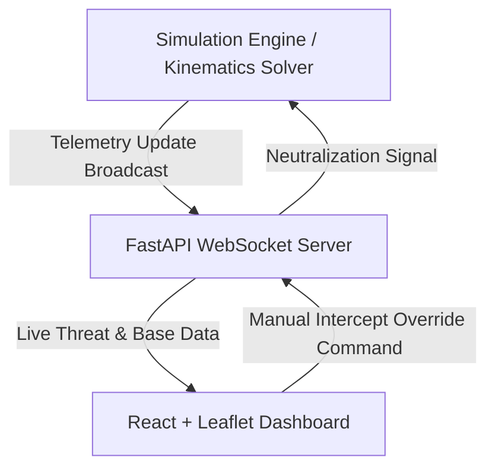

## MIDAS: Missile Interception Decision & Analysis System

> **"Outsmarting threats before they strike."**

---

### Introduction

Modern warfare demands rapid, automated responses. Stealthy and unpredictable aerial threats—such as **hypersonic missiles**, **cruise missiles**, and **drone swarms**—require defense systems that can operate with real-time accuracy and minimal latency. Traditional defense frameworks are often limited in addressing these next-generation hypersonic threats.

**MIDAS** (Missile Interception Decision and Analysis System) is an integrated, real-time tactical defense simulation and analysis system. It leverages machine learning for threat classification, predictive analytics for trajectory modeling, and Monte Carlo simulation algorithms for optimal interception planning—all visualized on a high-fidelity, real-time command dashboard.

---

### Key Features

- **Automated Threat Detection & Classification**: Processes real-time kinematic telemetry and classifies threats into Drone Swarms, Cruise Missiles, or Hypersonic Missiles.
- **Geodesic Interception Math**: Calculates optimal intercept trajectories using geodesic distances (accounting for the Earth's ellipsoidal curvature) instead of flat-plane approximations.
- **Monte Carlo Optimization**: Executes real-time simulation runs to evaluate interception probability, select the optimal launching facility, and minimize collateral risk.
- **Tactical Command Dashboard**: Built with a military-grade warspace dark theme, featuring a live interactive map, active threat HUD cards, operational activity logs, and deep mathematical decision analysis overlays.
- **Manual Command Protocol**: Allows commanding officers to dispatch immediate manual overrides and neutralize active threats directly from the dashboard.

---

### Architecture & Data Flow

MIDAS is structured as a decoupled web application with the following data pipeline:



1. **Simulation Engine (`simulator_bridge.py`)**: Models flight paths, speeds, and interceptor kinematics.
2. **FastAPI Backend API (`main.py`)**: Manages real-time WebSockets connections, updates active threat states, and acts as the central control layer.
3. **React Frontend (`App.jsx`)**: Renders the tactical geographic map, maps flight vectors, and handles user interactions.

---

### Machine Learning & Analytical Pipeline

| Phase | Component | Methodology | Details |
| :--- | :--- | :--- | :--- |
| **1** | **Threat Classification** | Rule-Based Velocity Analysis | Evaluates speed profiles: Drone Swarms ($< 1.5\text{ km/s}$), Cruise Missiles ($\ge 1.5\text{ km/s}$), Hypersonic Missiles ($\ge 4.0\text{ km/s}$). |
| **2** | **Path Prediction** | Kinematic Integration | Integrates latitude, longitude, and altitude profiles step-by-step. |
| **3** | **Interception Simulation** | Monte Carlo Optimization | Evaluates combinations of flight coordinates, interceptor locations, and speeds to predict a high-confidence intercept point. |
| **4** | **Risk Evaluation** | Airspace Geopolitical Weighting | Calculates risk scores based on proximity to high-value geopolitical areas and altitude. |
| **5** | **Decision Engine** | Objective Function Minimization | Selects the primary defense base by minimizing `(risk_score, interceptor_time)`. |

---

### Technical Implementation

#### Backend (`MIDAS/backend/`)
- **FastAPI**: Provides high-performance endpoints for status checks, base lists, and telemetry loops.
- **WebSockets**: Establishes continuous, low-latency client-server duplex channels.
- **Geopy**: Employs the WGS-84 geodesic distance calculations for precision target localization.

#### Frontend (`MIDAS/frontend/`)
- **Vite & React**: Ensures instantaneous HMR and efficient single-page DOM rendering.
- **Leaflet & React-Leaflet**: Renders smooth geographical maps with custom military styling (CartoDB Dark Matter base).
- **Custom Visual Indicators**: Uses custom-designed HTML/CSS markers for engaging radar ping rings, trajectory vector paths, and animated explosion states.

---

### Setup & Run Instructions

#### Prerequisites
- **Python 3.8+**
- **Node.js 18+**

#### 1. Backend Server Setup
1. Navigate to the backend directory:
   ```bash
   cd MIDAS/backend
   ```
2. Set up a virtual environment and install dependencies:
   ```bash
   python -m venv .venv
   source .venv/bin/activate  # On Windows: .venv\Scripts\activate
   pip install -r requirements.txt
   ```
3. Launch the API & WebSocket server:
   ```bash
   python -m uvicorn main:app --host 127.0.0.1 --port 8000
   ```

#### 2. Frontend Dashboard Setup
1. Navigate to the frontend directory:
   ```bash
   cd MIDAS/frontend
   ```
2. Install npm dependencies:
   ```bash
   npm install
   ```
3. Run the development server:
   ```bash
   npm run dev
   ```
4. Open your browser and navigate to `http://localhost:5173`.

---

### Future Enhancements
- Integration of actual YOLOv8 object detection pipelines on video feeds.
- Reinforcement learning models to optimize interceptor trajectories against evasive maneuvering targets.
- Multi-client synchronization and redundant failover server protocols.